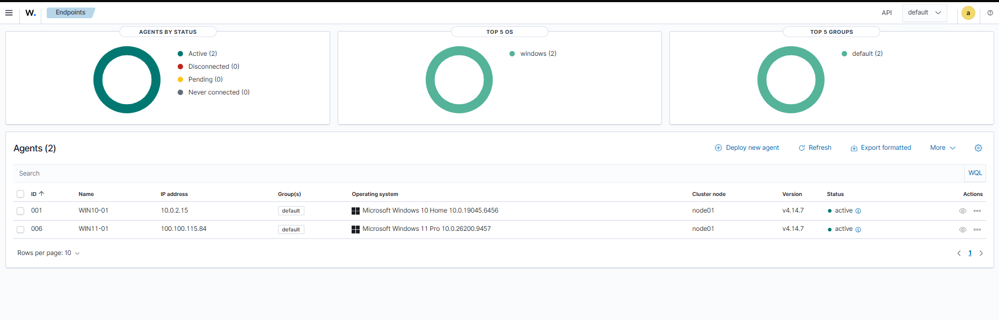
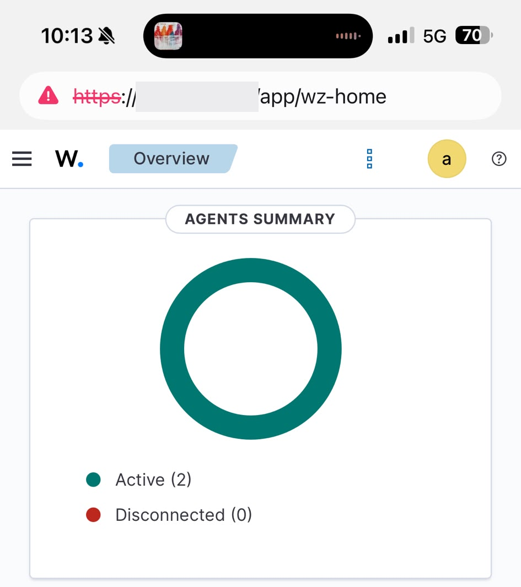

# Home SOC & Detection Engineering Lab

A self-hosted Wazuh SIEM monitoring two Windows endpoints, built to practise the full detection-engineering loop: validate telemetry, write and tune detection logic, correlate events, monitor file integrity, and close a hardening finding with independently verified remediation.

Every lab in this repository documents an **expected result**, an **actual result**, and the screenshot that proves it. Where something did not work, the troubleshooting is written up rather than edited out — that is usually the part worth reading.

**Author:** Mahmut Ekrem Acar — B.Sc. Informationssicherheit, THWS Würzburg-Schweinfurt
**Status:** Phase 1 complete (5 labs) · Phase 2 planned, not built

---

## Architecture

```text
┌─────────────────────────────┐          ┌──────────────────────────────┐
│  WIN11-01  (physical)       │          │  Wazuh all-in-one            │
│  Windows 11 Pro             │          │  Ubuntu Server               │
│  Wazuh Agent 4.14.7         │──agent──▶│  manager "home"              │
│  Sysmon (default config)    │  :1514   │  • wazuh-manager             │
├─────────────────────────────┤          │  • wazuh-indexer             │
│  WIN10-01  (VM)             │          │  • wazuh-dashboard           │
│  Windows 10                 │──agent──▶│                              │
│  Wazuh Agent 4.14.7         │  :1514   │  Wazuh 4.14.7                │
└─────────────────────────────┘          └──────────────────────────────┘
                    │                                    │
                    └────────── Tailscale ───────────────┘
                         (flat overlay network,
                          dashboard reachable from
                          any enrolled device)
```

| Component | Detail |
|---|---|
| SIEM | Wazuh 4.14.7, all-in-one deployment on Ubuntu Server |
| Endpoints | `WIN11-01` (Windows 11 Pro, physical) · `WIN10-01` (Windows 10, VM) |
| Agents | Wazuh Agent 4.14.7, both `active` |
| Endpoint telemetry | Native Windows event log (System, Security) · Sysmon, default configuration · Wazuh syscheck (FIM) · Wazuh SCA |
| Network | Tailscale overlay — endpoints and manager on separate physical hosts |



*Two agents enrolled, both active, on Wazuh 4.14.7.*



*The dashboard reached over Tailscale from a mobile device — the overlay network makes the SIEM available without exposing it to the internet.*

---

## The labs

| # | Lab | What it demonstrates | Key rule IDs | MITRE ATT&CK |
|---|---|---|---|---|
| **000** | [Telemetry Validation](labs/LAB-000-telemetry-validation.md) | End-to-end pipeline proof and structured fault isolation, before any detection logic is written | `61138` | T1543.003 |
| **001** | [PowerShell Detection Engineering](labs/LAB-001-powershell-detection.md) | **Custom rules written from scratch** — four tiers grading severity on command-line evidence, tested against benign *and* suspicious input | `100100`–`100103` | T1059.001, T1105 |
| **002** | [Failed Authentication & Correlation](labs/LAB-002-authentication-correlation.md) | Temporal correlation across many events, and the judgement to retire a custom rule the platform already covered | `60122`, `60204` | T1110 |
| **003** | [File Integrity Monitoring](labs/LAB-003-file-integrity-monitoring.md) | Stateful real-time FIM — a complete forensic chain across create, modify and delete on one file | `554`, `550`, `553` | T1565.001, T1070.004, T1485 |
| **004** | [Security Configuration Assessment & Remediation](labs/LAB-004-sca-remediation.md) | A full, auditable hardening cycle against CIS Windows 11 v3.0.0, with independent verification of the fix | `19010` (SCA check `26002`) | — (CIS 1.1.3) |

---

## What this lab set is meant to show

**Detection engineering, not tool installation.** LAB-001 is the core: custom Wazuh rules built on Sysmon Event ID 1, escalating from level 3 to level 10 based on what the command line actually contains, each tier validated by a test designed to trigger exactly that tier and no other. Alerting on the presence of `powershell.exe` is a noise generator; alerting on *download indicator AND execution verb* is a detection.

**Four different detection primitives, deliberately.** Content matching on a single event (LAB-001), temporal correlation across many (LAB-002), stateful baseline comparison (LAB-003) and configuration assessment (LAB-004) are genuinely different capabilities that fail in different ways. Building one of each was the point.

**The discipline to delete a rule.** LAB-002 documents a working frequency-correlation rule that was written, tested — and then retired, because Wazuh's built-in rule `60204` already did the job. Two alerts for one behaviour is noise. Writing the rule is how the built-in one was found; shipping it would have made the ruleset worse.

**Troubleshooting written up honestly.** Every lab that broke says how and why:

- LAB-000 — the "missing" alert was a Threat Hunting view filtered to the wrong endpoint. *A missing alert has at least four distinct causes, and they should be checked in order.*
- LAB-001 — the rules did not fire because the **test data** never contained the indicators. *Compare the regex against the real field value in the exported event before editing the pattern.*
- LAB-002 — `runas` errored *before* authentication was attempted, so no Event 4625 was ever produced. *A tool failing is not the same as an authentication failing.*
- LAB-004 — the Configuration Assessment panel still showed the check as failed after a successful rescan. *When an aggregated dashboard contradicts the endpoint's own logs, go to the raw events.*

**Evidence over assertion.** LAB-004 is the clearest case: "I changed the setting" is self-reporting, while `previous_result: failed` → `result: passed`, observed by the tool on its own next scan, is independent verification.

---

## Repository layout

```text
wazuh-home-soc-lab/
├── README.md                  this file
├── configs/
│   └── custom-rules.xml       the custom rule set, commented
├── labs/
│   ├── LAB-000-telemetry-validation.md
│   ├── LAB-001-powershell-detection.md
│   ├── LAB-002-authentication-correlation.md
│   ├── LAB-003-file-integrity-monitoring.md
│   └── LAB-004-sca-remediation.md
└── screenshots/
    ├── architecture/
    └── lab-000/ … lab-004/
```

Each lab note follows the same structure: **Objective → Environment → Detection concept → Configuration → Test procedure → Expected vs actual → Evidence → Troubleshooting → Lessons learned → MITRE ATT&CK.**

---

## Custom rules

`configs/custom-rules.xml` lives on the manager at `/var/ossec/etc/rules/local_rules.xml`.

| Rule | Level | Fires on | MITRE |
|---|---|---|---|
| `100100` | 3 | Baseline PowerShell execution | T1059.001 |
| `100101` | 6 | `-ExecutionPolicy Bypass` / `-WindowStyle Hidden` | T1059.001 |
| `100102` | 8 | `WebClient` / `DownloadFile` / `DownloadString` / `Invoke-WebRequest` | T1059.001, T1105 |
| `100103` | 10 | Download indicator **AND** an execution verb | T1059.001, T1105 |
| `100200` | — | *Retired.* Frequency correlation on failed logons — superseded by built-in `60204` | T1110 |

Validate before restarting the manager:

```bash
sudo /var/ossec/bin/wazuh-analysisd -t
sudo systemctl restart wazuh-manager
```

---

## Scope and honesty

Deliberately stated, because a portfolio is worth less than nothing if it overclaims:

- **All testing was authorised and benign.** No malware, no exploitation, no live payloads. The PowerShell tests place suspicious-looking *strings* on the command line — `Write-Output` prints them back; nothing is downloaded and nothing is executed. The lab account `WazuhLabUser` was created for the authentication lab and exists nowhere else.
- **A detection firing is not proof of an attack.** `100103` on Test D is a true-positive detection of a *behaviour*, produced by a test the author ran on his own machine. Both things are true at once, and a SOC analyst has to hold both.
- **These labs demonstrate visibility of ATT&CK techniques, not tuned production detections for them.** The distinction is kept in every lab note.
- **Sysmon runs in its default configuration.** No curated config (SwiftOnSecurity, Olaf Hartong) was applied — that is Phase 2 work, and the default keeps the pipeline simple while rule logic is being validated.
- **This is a home lab.** Two endpoints, no domain, no scale. Nothing here has been tested against production alert volume.
- **Phase 2 is not built.** Nothing below this line exists yet.

---

## Roadmap — Phase 2 (planned, not built)

- **Active Directory lab** — a domain controller, so that domain authentication, Kerberos and Group Policy-driven hardening can be tested rather than only standalone local accounts.
- **Atomic Red Team** — replace hand-written test commands with a standard adversary-emulation harness, giving repeatable coverage measurement instead of one-off tests.
- **Curated Sysmon configuration** — swap the default config for a tuned one and re-measure what the existing rules still catch.
- **Sigma / detection-as-code** — author detections as Sigma rules, convert them to the Wazuh backend, and validate them in CI so a rule change is reviewed like code.
- **Alert tuning and false-positive baselining** — run the rule set against several days of normal use and tune on the results.

---

## Acknowledgements & references

- [Wazuh documentation](https://documentation.wazuh.com/) — rule syntax, syscheck, SCA
- [Sysmon (Microsoft Sysinternals)](https://learn.microsoft.com/sysinternals/downloads/sysmon)
- [MITRE ATT&CK](https://attack.mitre.org/)
- [CIS Microsoft Windows 11 Enterprise Benchmark v3.0.0](https://www.cisecurity.org/cis-benchmarks)

Screenshots are redacted where they showed host identifiers. Some field values render in Turkish because the endpoint runs a localized Windows install.
