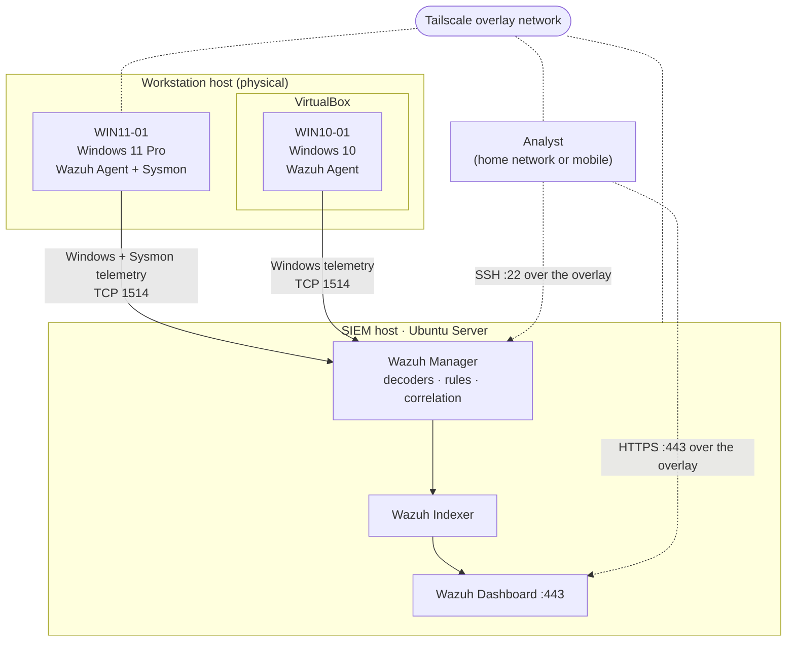

# Architecture & Environment

The built state of the Home SOC lab. Addresses and machine names are replaced with placeholders throughout — see the note at the bottom.

## Data flow



**In words:** an endpoint generates an event → the Wazuh agent forwards it → the manager decodes it and runs the rule engine → matches become alerts → the indexer stores them → the dashboard makes them searchable. Endpoint-to-manager traffic and analyst access both ride a Tailscale overlay, so nothing is published to the public internet.

## SIEM host

| Field | Value |
|---|---|
| Machine | Repurposed laptop — dual-core Intel i5 (4 threads), 16 GB RAM |
| OS | Ubuntu Server |
| Stack | Wazuh all-in-one — Manager · Indexer · Dashboard |
| Version | **4.14.7** |
| Availability | Powered on for lab sessions — **not 24/7** |

### Sizing

16 GB is double Wazuh's 8 GB all-in-one recommendation, so RAM is not the constraint. The **dual-core CPU sits below the 4-vCPU recommendation**, which makes CPU the limit — worth watching during indexing before adding agents. Stating the bottleneck is more useful than stating the spec.

## Endpoints

| Agent ID | Name | Type | OS | Language | Telemetry |
|---|---|---|---|---|---|
| `006` | **WIN11-01** | Physical host | Windows 11 Pro | Localized (non-English) | Windows Event Log + **Sysmon** |
| `001` | **WIN10-01** | VirtualBox VM | Windows 10 | English | Windows Event Log |

WIN11-01 is the primary detection endpoint. WIN10-01 is the second endpoint and shows as disconnected when the VM is powered off — expected, not a fault.

**The language difference is deliberate and load-bearing.** The same Event 7045 renders in the endpoint's own locale in LAB-000; localization is why `auditpol` must be addressed by GUID in LAB-002; and it makes WIN10-01 the natural control machine for the Who-data comparison that LAB-003 identifies as unfinished work.

> **Agent name and Windows hostname are separate identities.** Alerts carry the Wazuh agent name (`WIN11-01`) alongside `data.win.system.computer`, which is the real Windows hostname. They do not have to match, and the difference caused a real incident — see `docs/troubleshooting.md` §6.

## Network

| Port | Purpose |
|---|---|
| TCP 1514 | Agent → manager telemetry |
| TCP 1515 | Agent enrollment |
| TCP 443 | Wazuh Dashboard (HTTPS) |
| TCP 22 | SSH to the SIEM host |

The lab started on plain LAN addressing and was migrated to a Tailscale overlay. Agent communication and analyst access now use the overlay address, which works identically at home and away — Tailscale selects a direct LAN path when both peers happen to be on the same network.

That last property is also a testing trap: verifying remote access from inside the home LAN proves only that Tailscale is installed. The verification that counts was repeated from a mobile hotspot.

### Remote access verification, in order

1. `tailscale ping <WAZUH_SERVER_IP>` → `pong`
2. `Test-NetConnection <WAZUH_SERVER_IP> -Port 22` → `TcpTestSucceeded : True`
3. `Test-NetConnection <WAZUH_SERVER_IP> -Port 443` → `TcpTestSucceeded : True`
4. Dashboard at **`https://<WAZUH_SERVER_IP>`** — the explicit `https://` matters; `<WAZUH_SERVER_IP>:443` sends plain HTTP to a TLS port and returns `ERR_EMPTY_RESPONSE`. A certificate warning is expected, since the certificate was not issued for an overlay IP.
5. **Steps 1–4 repeated from off the home network** — the only step that actually proves remote access.

## Agent configuration

Client and enrollment:

```xml
<client>
  <server>
    <address><WAZUH_SERVER_IP></address>
    <port>1514</port>
    <protocol>tcp</protocol>
  </server>

  <enrollment>
    <enabled>yes</enabled>
    <manager_address><WAZUH_SERVER_IP></manager_address>
    <port>1515</port>
    <agent_name>WIN11-01</agent_name>
  </enrollment>
</client>
```

The `<enrollment>` block with an explicit `<agent_name>` was added **after** an agent-naming incident. Without it, a re-enrollment falls back to the Windows hostname and silently creates a second agent identity.

Sysmon collection:

```xml
<localfile>
  <location>Microsoft-Windows-Sysmon/Operational</location>
  <log_format>eventchannel</log_format>
</localfile>
```

File Integrity Monitoring:

```xml
<syscheck>
  <directories check_all="yes" report_changes="yes" realtime="yes">C:\SecurityLab</directories>
</syscheck>
```

Full snippets with comments: [`../configs/agent-ossec-conf-snippets.xml`](../configs/agent-ossec-conf-snippets.xml).

## Security posture

- No Wazuh service is exposed to the public internet. No port forwarding, no reverse proxy.
- Access is LAN or overlay only — a private network with device-level authentication.
- The dashboard certificate is self-signed for lab use.

**Secure remote access did not require public exposure.** That is the design decision worth defending here: the alternative — port-forwarding a dashboard to the internet — is how home labs become someone else's foothold.

> **Open posture items, stated rather than glossed over.** Default admin credentials are not confirmed as changed; host firewall rules are not confirmed; SSH is not confirmed as key-only. These are recorded as unverified rather than claimed as done. A hardened-posture claim belongs in this section only once each has been checked.

## A note on placeholders

Real overlay and LAN addresses, machine names and account names are replaced here with `<WAZUH_SERVER_IP>` and generic host labels. They are not secrets, but publishing them is unnecessary infrastructure disclosure and placeholders cost nothing. Credentials, agent keys and complete operational `ossec.conf` dumps are never published — see the repository `.gitignore`.
