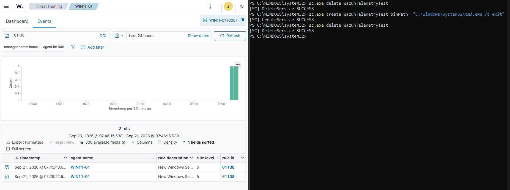
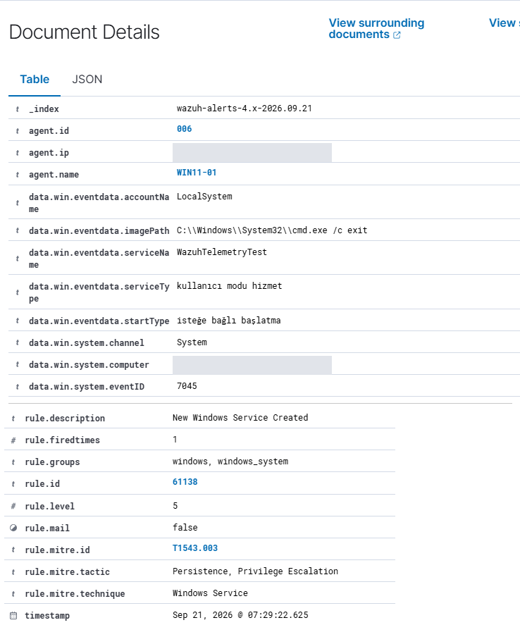
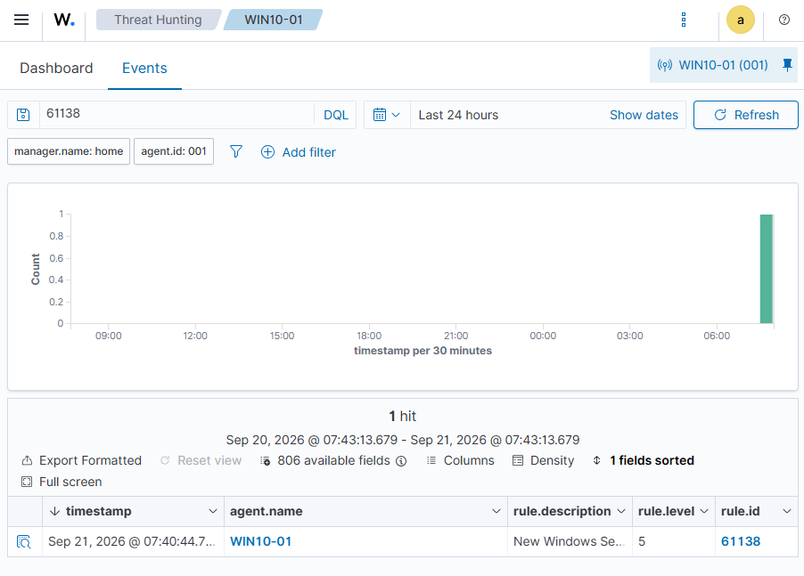

# LAB-000 — Telemetry Validation

**Status:** ✅ Complete

## Objective

Prove that an event generated on a Windows endpoint reaches the Wazuh SIEM and becomes a visible alert — before writing any detection logic on top of that pipeline.

The lab answers exactly one question: *if something happens on the endpoint, does the SIEM see it?*

## Environment

| Component | Value |
|---|---|
| Endpoints | `WIN11-01` (Windows 11 Pro, physical), `WIN10-01` (Windows 10, VM) |
| Agent | Wazuh Agent 4.14.7 |
| SIEM | Wazuh all-in-one on Ubuntu Server |

Sysmon is deliberately **not** used here. Native Windows logging is validated on its own first, so that any later Sysmon failure can be isolated to the Sysmon layer rather than to the agent or the network.

## Detection concept

Installing a Windows service writes **System Event ID 7045**. That makes it a good validation trigger on three counts: it is a normal administrative action, Windows logs it natively with no additional tooling, and it is also a well-known persistence technique — so a SIEM ought to see it.

Wazuh maps Event ID 7045 to built-in rule **61138 — New Windows Service Created**.

## Test procedure

From an Administrator PowerShell on the endpoint:

```powershell
sc.exe create WazuhTelemetryTest binPath= "C:\Windows\System32\cmd.exe /c exit"
```

Two details matter. The space after `binPath=` is required by `sc.exe`. And the service is never started — `cmd.exe /c exit` would do nothing anyway. Only the *registration event* is wanted.

Verify in two places, in this order:

1. **Event Viewer → Windows Logs → System**, filter Event ID `7045`, confirm `Service Name: WazuhTelemetryTest`
2. **Wazuh → Threat Hunting → [endpoint] → Events**, last 15 minutes, search `rule.id:61138`

Clean up:

```powershell
sc.exe delete WazuhTelemetryTest
```

## Expected result

Event 7045 present in the local Windows log **and** a matching `61138` alert in Wazuh, attributed to the correct agent.

## Actual result

✅ **Pass on both endpoints.**

| Run | Endpoint | Windows 7045 | Wazuh 61138 |
|---|---|---|---|
| Initial validation | `WIN10-01` | ✅ | ✅ |
| Re-validation before Sysmon work | `WIN11-01` | ✅ | ✅ |

## Relevant IDs

| Layer | ID | Meaning |
|---|---|---|
| Windows System event | `7045` | A service was installed |
| Wazuh rule | `61138` | New Windows Service Created — level 5 |
| MITRE ATT&CK (applied by Wazuh) | `T1543.003` | Windows Service — Persistence, Privilege Escalation |

## Evidence



*Action and result in one frame: `sc.exe create` / `delete` on the right, the matching rule `61138` alerts for `WIN11-01` in Threat Hunting on the left. Two hits from two separate runs.*



*The expanded alert. `eventID 7045` and `serviceName WazuhTelemetryTest` come from the Windows event; `rule.id 61138`, level 5, and the ATT&CK mapping `T1543.003` are applied by Wazuh. The service-type fields are in Turkish because the endpoint runs a localized Windows install. Agent IP and Windows hostname redacted.*



*The same test on the second endpoint, `WIN10-01` — the pipeline is not a single-host special case.*

## Analysis

The proven chain:

```text
Windows endpoint → Windows event log → Wazuh agent → Wazuh Manager → Wazuh alert
```

On the first attempt the alert could not be found. The cause was not the pipeline: the Threat Hunting view was filtered to one endpoint while the service had been created on the other. That is the lab's most useful moment — *"no alert"* is not a single condition.

## Lessons learned

- Telemetry validation comes before detection engineering. An untested pipeline produces silent failures, not alerts.
- A missing alert has at least four distinct causes: the endpoint did not log it, the agent did not forward it, no rule matched it, or the search is scoped to the wrong agent or time range. Each has a different fix, and they should be checked in that order.
- Validate native logging before layering Sysmon on top, so failures stay isolatable.
- Service creation is both a routine admin action and a persistence technique — which is exactly why a production detection for it needs tuning rather than a blanket alert.

## Portfolio takeaway

End-to-end pipeline validation and structured fault isolation: the first thing that should happen after standing up a SIEM, and the step most home labs skip.

## MITRE ATT&CK

Wazuh's built-in rule `61138` itself tags the event **T1543.003 — Create or Modify System Process: Windows Service** (tactics: Persistence, Privilege Escalation), visible in the expanded alert above. This lab demonstrates *visibility* of that technique, not a tuned detection for it.
