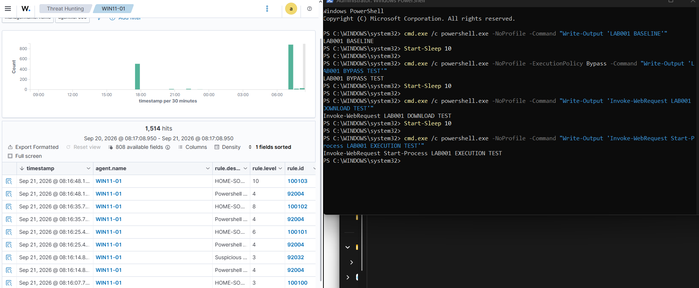
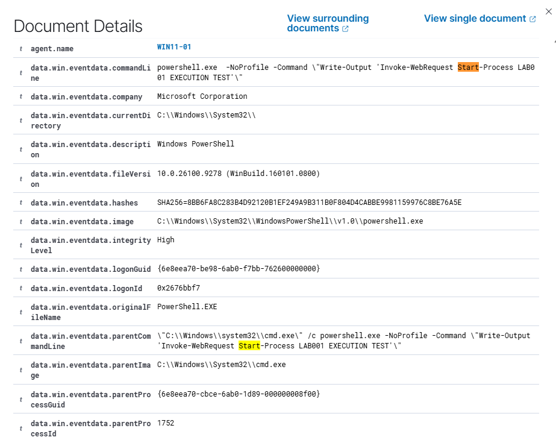

# LAB-001 — PowerShell Detection Engineering

**Status:** ✅ Complete

The only lab where the detection logic is written from scratch, tuned, and validated against both benign and suspicious input.

## Objective

Build a graded set of custom Wazuh rules that detect PowerShell execution from Sysmon process-creation telemetry, escalating severity based on **evidence in the command line** rather than on the presence of `powershell.exe` alone.

## Environment

| Component | Value |
|---|---|
| Endpoint | `WIN11-01` — Windows 11 Pro, physical |
| Telemetry | Sysmon, **default configuration** (`Sysmon64.exe -accepteula -i`) |
| Channel | `Microsoft-Windows-Sysmon/Operational` |
| SIEM | Wazuh 4.14.7 |
| Rules file | `/var/ossec/etc/rules/local_rules.xml` |

No curated Sysmon configuration (SwiftOnSecurity, Olaf Hartong) was applied. The default keeps the pipeline simple while the rule logic is being validated; swapping in a curated config is Phase 2 work.

Agent-side collection:

```xml
<localfile>
  <location>Microsoft-Windows-Sysmon/Operational</location>
  <log_format>eventchannel</log_format>
</localfile>
```

## Detection concept

Sysmon **Event ID 1 (Process Creation)** carries the full command line. That is the difference between knowing *that* PowerShell ran and knowing *what it was told to do* — and it is why native Windows logging alone is not enough for this lab.

Fields used:

```text
win.eventdata.image         matched with  (?i)\\powershell\.exe$
win.eventdata.commandLine   matched for behavioural indicators
```

The dashboard displays these with a leading `data.` prefix; the rule XML references the decoded field without it.

## Configuration

| Rule | Level | Detects | MITRE |
|---|---|---|---|
| `100103` | 10 | Download indicator **AND** `Start-Process` | T1059.001, T1105 |
| `100102` | 8 | `WebClient` / `DownloadFile` / `DownloadString` / `Invoke-WebRequest` | T1059.001, T1105 |
| `100101` | 6 | `-ExecutionPolicy Bypass` / `-WindowStyle Hidden` | T1059.001 |
| `100100` | 3 | Baseline PowerShell execution | — |

Full commented file: [`../configs/custom-rules.xml`](../configs/custom-rules.xml)

Multiple `<field>` conditions within one rule are a logical AND — which is how `100103` requires PowerShell *and* a download string *and* an execution verb.

Validate before restarting:

```bash
sudo /var/ossec/bin/wazuh-analysisd -t
sudo systemctl restart wazuh-manager
```

## Test procedure

Four commands, each designed to trigger exactly one tier, run 10 seconds apart so each alert is clearly separated. They place suspicious-looking strings in the command line and nothing more — **nothing is downloaded and nothing is executed**. `Write-Output` simply prints the string back.

Each test is launched through `cmd.exe /c`, so every PowerShell process in the evidence has `cmd.exe` as its parent — a clean, repeatable process tree.

```powershell
# A — baseline                          → expect 100100
cmd.exe /c powershell.exe -NoProfile -Command "Write-Output 'LAB001 BASELINE'"
Start-Sleep 10

# B — suspicious execution flag         → expect 100101
cmd.exe /c powershell.exe -NoProfile -ExecutionPolicy Bypass -Command "Write-Output 'LAB001 BYPASS TEST'"
Start-Sleep 10

# C — download indicator                → expect 100102
cmd.exe /c powershell.exe -NoProfile -Command "Write-Output 'Invoke-WebRequest LAB001 DOWNLOAD TEST'"
Start-Sleep 10

# D — download + execution indicator    → expect 100103
cmd.exe /c powershell.exe -NoProfile -Command "Write-Output 'Invoke-WebRequest Start-Process LAB001 EXECUTION TEST'"
```

## Expected vs actual result

| Test | Indicator in command line | Expected | Actual |
|---|---|---|---|
| A — baseline | none | `100100`, level 3 | ✅ |
| B — flag | `-ExecutionPolicy Bypass` | `100101`, level 6 | ✅ |
| C — download | `Invoke-WebRequest` | `100102`, level 8 | ✅ |
| D — download + execution | `Invoke-WebRequest` + `Start-Process` | `100103`, level 10 | ✅ |

Test D matched the conditions of `100100`, `100102` **and** `100103` — and produced only `100103`. That is the "most specific rule wins" behaviour the rule set was redesigned around, observed directly.

### Built-in coverage observed alongside

The same run also produced built-in Wazuh Sysmon alerts: **`92004`** (a PowerShell-related rule, level 4) next to every test, and **`92032`** (level 3). One command creates more than one Sysmon process event — the `cmd.exe` wrapper and the `powershell.exe` child — and each event is evaluated separately, so a single test can surface both a custom alert and a built-in one. Built-in PowerShell coverage exists, but it is flat (levels 3–4) where the custom rules grade severity by behaviour.

## Evidence



*The four tests on the right, the resulting alerts for `WIN11-01` on the left: `100100` (3) → `100101` (6) → `100102` (8) → `100103` (10), each 10 seconds apart. Built-in rules `92004` and `92032` appear in between.*



*The `100103` alert expanded: the full `commandLine` containing both indicators, `image` = `powershell.exe`, `parentImage` = `cmd.exe`, the process SHA-256, and integrity level `High`. This is the Sysmon Event ID 1 detail that native Windows logging does not provide.*

## Troubleshooting — the redesign

The first design expected `100101`, `100102` and `100103` to fire *alongside* `100100` for a single event, as a cascade. Only `100100` appeared.

Two causes, both instructive:

**One event, one alert.** Wazuh emits the most specific matching rule for an event, not every conceptual stage at once. The rules were rewritten as four independent, self-contained detections ordered by specificity.

**The test data did not contain the indicators.** The exported event's `commandLine` field held only the plain PowerShell path — there was genuinely nothing for the stronger rules to match. The test commands, not the rules, were the problem.

The general method that resolved it: when a rule does not fire, open the raw event and compare the real field value against the pattern **before** editing the pattern. Blind regex changes produce rules that match nothing while looking plausible.

## Lessons learned

- **Telemetry is not an alert.** Sysmon Event ID 1 was reaching Wazuh throughout. Wazuh maps it to built-in rule `61603`, which is **level 0** — a classification rule that deliberately raises nothing. Raw telemetry can be present and correct while Threat Hunting looks empty.
- **A detection is not proof of malicious activity.** `100103` firing on Test D is a true positive detection *of the behaviour*, produced by authorised benign testing. A SOC analyst has to hold both ideas at once.
- Severity should escalate on evidence, not on process name. "Alert on every `powershell.exe`" is not a detection, it is a noise generator.
- Match the regex against the real field value in the exported event, not against what the command looked like when it was typed.

## Portfolio takeaway

The complete detection-engineering loop in one lab: baseline visibility → identify the overly general detection → add behavioural indicators → grade severity → test benign *and* suspicious variants → verify → map to ATT&CK.
