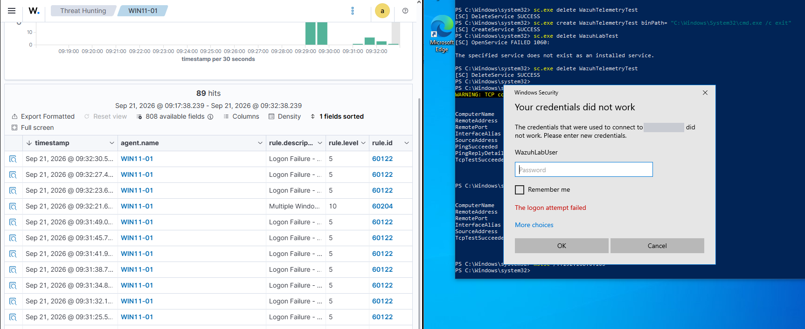
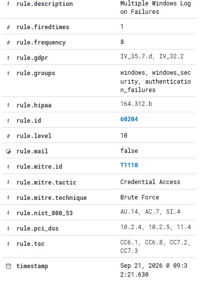
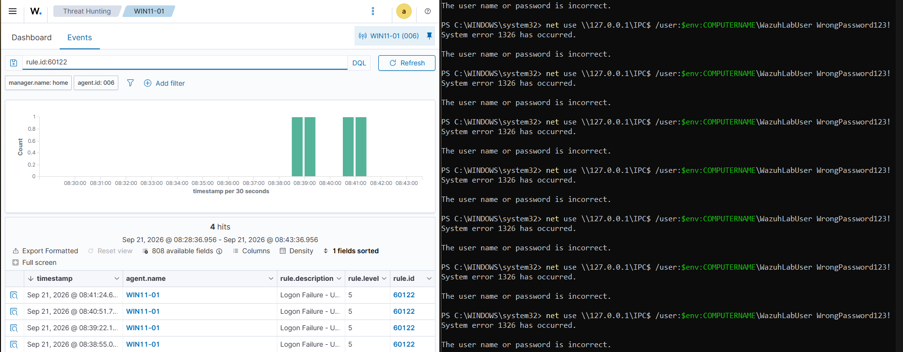

# LAB-002 — Failed Authentication & Correlation

**Status:** ✅ Complete

## Objective

Generate failed Windows logons, observe the individual detection, and then observe how the SIEM escalates **repeated** failures into a single higher-severity correlation alert.

A different skill from LAB-001: that lab was content matching on one event; this one is temporal correlation across many.

## Environment

| Component | Value |
|---|---|
| Endpoint | `WIN11-01` — Windows 11 Pro, standalone, **non-English (localized) Windows** |
| Telemetry | Native Windows Security log — no Sysmon required |
| Test account | `WazuhLabUser`, a local account created for this lab only |
| SIEM | Wazuh 4.14.7 |

### Audit policy verification on localized Windows

Querying audit subcategories by their English name fails on a localized install:

```powershell
auditpol /get /subcategory:"Logon"
# Error 0x00000057 occurred: The parameter is incorrect.
```

Subcategory **names are translated by the OS; GUIDs are not.** The portable form:

```powershell
auditpol /get /subcategory:"{0CCE9215-69AE-11D9-BED3-505054503030}"   # Logon
```

This confirmed Logon auditing was already set to Success and Failure. Any runbook or script that touches Windows auditing should use GUIDs for exactly this reason.

## Detection concept

```text
Wrong password → Windows Security Event 4625 → Wazuh rule 60122 (level 5)
                                                     ↓ repeated failures
                                              Wazuh rule 60204 (level 10)
```

## Test procedure

Create the disposable lab account:

```powershell
net user WazuhLabUser "<LAB_PASSWORD>" /add
```

Finding a reliable way to generate failures took several attempts. The first method is documented because it *looks* like it works but produces no 4625 at all:

```powershell
# Does NOT reliably produce 4625 — fails before authentication is attempted
runas /user:.\WazuhLabUser cmd.exe
# RUNAS ERROR: Unable to acquire user password
```

```powershell
# Works — interactive credential, then a failing process launch
$cred = Get-Credential "$env:COMPUTERNAME\WazuhLabUser"   # enter a deliberately wrong password

1..6 | ForEach-Object {
    try { Start-Process cmd.exe -Credential $cred -ErrorAction Stop }
    catch { Write-Host "Failed login attempt $_" }
    Start-Sleep -Seconds 3
}
```

```powershell
# Also works — produces a network logon type, which populates logonType
net use \\127.0.0.1\IPC$ /user:$env:COMPUTERNAME\WazuhLabUser <WRONG_PASSWORD>
```

```powershell
# Final evidence method — failed RDP logons from a second machine
# From WIN10-01: Remote Desktop Connection → WIN11-01 → user WazuhLabUser → wrong password, repeated
```

The correlation evidence was produced this way: repeated failed **Remote Desktop** logons from `WIN10-01` to `WIN11-01` across the lab network. It is the most realistic of the methods — the failures arrive over the network from a different host, which is what a password-guessing attempt against a real workstation looks like. It also produced a steady stream of `60122` alerts, which the loopback `net use` method did not (see below).

Verify the raw Windows event first (Event Viewer → Windows Logs → Security, filter `4625`), then search Wazuh for `rule.id:60122`.

## Expected vs actual result

| Stage | Expected | Actual |
|---|---|---|
| Windows records the failure | Event ID `4625` | ✅ |
| Wazuh detects one failure | Rule `60122`, level 5 — *Logon Failure - Unknown user or bad password* | ✅ |
| Wazuh correlates repeated failures | A single higher-severity alert | ✅ Rule `60204`, level 10 — *Multiple Windows Logon Failures* |

### What rule 60204 actually requires

The expanded `60204` alert shows `rule.frequency: 8` — the built-in rule fires once **8** matching failures have been seen within its timeframe. Wazuh also tags it itself with **MITRE T1110 (Brute Force, Credential Access)** and with compliance references: PCI DSS `10.2.4`, `10.2.5`, `11.4`; NIST 800-53 `AU.14`, `AC.7`, `SI.4`; plus GDPR, HIPAA and TSC controls.

That threshold explains the method difference. The loopback `net use` run produced only **four** `60122` alerts across about two and a half minutes — never enough to reach eight — so it could demonstrate single-event detection but not correlation. The RDP run produced a continuous stream of `60122` alerts, and `60204` fired as soon as the threshold was crossed, while further `60122` alerts kept arriving after it.

## Evidence



*Right: a failed Remote Desktop logon as `WazuhLabUser` from `WIN10-01` to `WIN11-01` (target address redacted). Left: the resulting stream of `60122` alerts (level 5) on `WIN11-01`, with the correlation alert `60204` (level 10) appearing once the threshold was reached — and individual failures continuing after it.*



*`rule.frequency: 8`, level 10, and the ATT&CK and compliance mappings Wazuh attaches to the built-in rule.*



*The loopback `net use` method: single failures detected as `60122`, but only four across ~2.5 minutes — below the correlation threshold.*

## Analyst fields on a 60122 alert

```text
data.win.eventdata.targetUserName      which account
data.win.eventdata.targetDomainName
data.win.eventdata.logonType           interactive vs network
data.win.eventdata.status / subStatus  why it failed
data.win.eventdata.workstationName
data.win.eventdata.ipAddress
data.win.eventdata.processName
```

Triage questions: which account, how many attempts, local or network, which host, what logon type — and crucially, **was there a successful logon immediately afterwards**. Five failures followed by a success is a different story from one typo followed by nothing.

## The custom rule that was written, then retired

A frequency-based correlation rule was written first:

```xml
<rule id="100200" level="10" frequency="5" timeframe="120">
  <if_matched_sid>60122</if_matched_sid>
  <same_field>win.eventdata.targetUserName</same_field>
  <description>HOME-SOC: Multiple failed Windows logons for the same account</description>
  <mitre><id>T1110</id></mitre>
</rule>
```

It is structurally correct and a useful exercise in `frequency`, `timeframe`, `if_matched_sid` and `same_field`. It never fired — generating five genuine `60122` events inside one 120-second window proved harder than expected. While investigating that, **Wazuh's built-in rule `60204` turned out to already do exactly this job**.

Rule `100200` was therefore retired rather than shipped. Two alerts for one behaviour is noise, and removing noise is what tuning is for.

> **The transferable lesson:** before writing a new SIEM detection, verify whether the platform already provides equivalent coverage. Writing `100200` was not wasted — it is how the built-in rule was found — but shipping it would have made the ruleset worse.

The retired rule is preserved, commented out, in [`../configs/custom-rules.xml`](../configs/custom-rules.xml).

## Side observation — one action, many signals

A single `net use \\127.0.0.1\IPC$` produced several unrelated detections at once:

```text
92037   net.exe connecting to a remote resource
92106   SMB activity / possible admin-share access
60122   Authentication failure
```

Only `60122` increments the correlation counter for `if_matched_sid:60122`. A clean illustration of why investigation means correlating several signal types rather than reading one alert in isolation.

## Lessons learned

- Windows Event ID 4625 records failed authentication, and Wazuh detects it with **no custom rule at all**. Check what you already have before building.
- Correlation is a distinct capability from content matching: same events, different severity, different analyst priority.
- On localized Windows, address `auditpol` subcategories by GUID.
- A tool failing is not the same as an authentication failing. `runas` errored *before* authentication — verify the raw Windows event before blaming the SIEM.

## Portfolio takeaway

Both sides of detection-engineering judgement in one lab: the ability to write a frequency-correlation rule, and the discipline to delete it once the platform proved it redundant.

## MITRE ATT&CK

**T1110 — Brute Force.** Framed honestly: this lab demonstrates detection of *repeated authentication failure*, which is the observable of T1110, produced here by authorised testing rather than by an attack.
