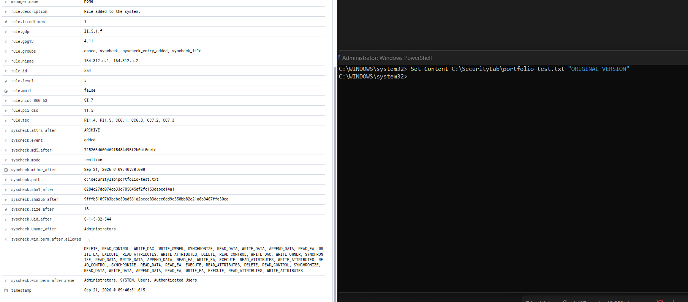
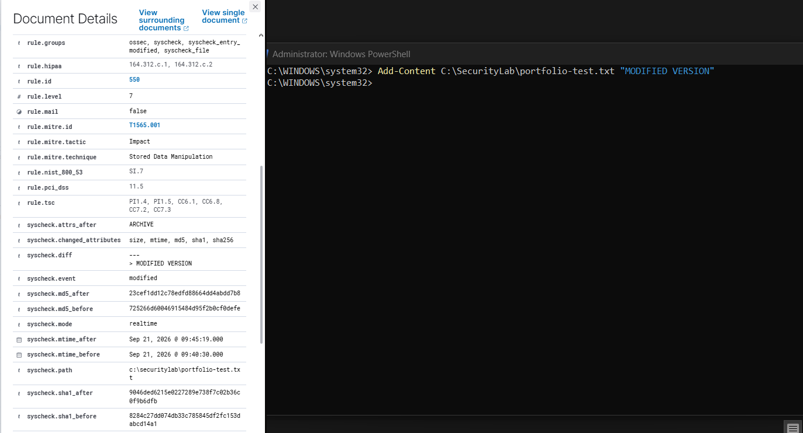
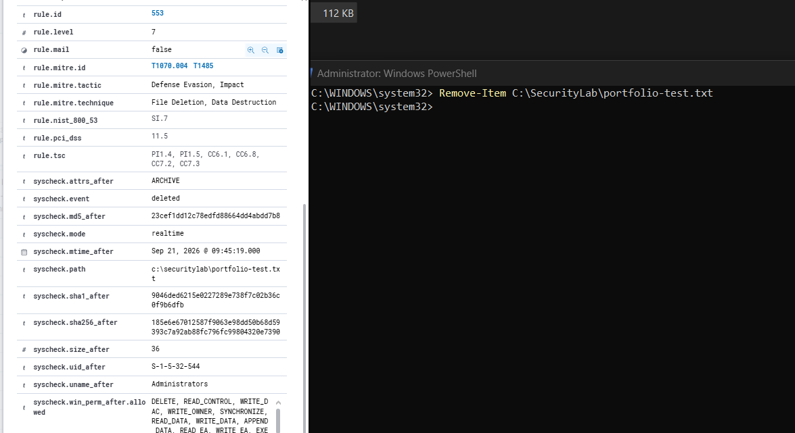

# LAB-003 — File Integrity Monitoring

**Status:** ✅ Core objective complete · ⚠️ Optional enhancement (Who-data) investigated and documented as a limitation

## Objective

Put a directory under real-time File Integrity Monitoring and prove that Wazuh detects and distinguishes all three states of a file's lifecycle — **created**, **modified**, **deleted** — with enough forensic detail to reconstruct what changed without ever touching the endpoint.

The question this lab answers is not *"did something happen?"* but *"what exactly changed, and can I prove it after the fact?"*

**Secondary objective:** enable Wazuh's **Who-data** feature to attribute each file change to a specific user and process. This did not become operational, and the investigation into why is written up in full below — it is the most substantial troubleshooting work in the project.

## Environment

| Component | Value |
|---|---|
| Endpoint | `WIN11-01` — Windows 11 Pro, physical, **non-English (localized) Windows** |
| Telemetry | Wazuh **syscheck** (FIM) module — no Sysmon required |
| Monitored path | `C:\SecurityLab` |
| Mode | `realtime` |
| Agent | Wazuh Agent 4.14.7 · config at `C:\Program Files (x86)\ossec-agent\ossec.conf` |
| SIEM | Wazuh 4.14.7 |

Agent-side configuration, added inside the **existing** `<syscheck>` block — never as a second one:

```xml
<directories check_all="yes" report_changes="yes" realtime="yes">C:\SecurityLab</directories>
```

Three attributes carry the lab:

- `realtime="yes"` — changes are reported as they happen rather than on the next scheduled scan.
- `check_all="yes"` — size, permissions, owner, group, mtime, inode, MD5, SHA-1, SHA-256 and attributes are all recorded, which is what makes the before/after comparison possible.
- `report_changes="yes"` — Wazuh stores a diff of the content, not just the fact that the hash moved.

The monitored directory must exist **before** the agent restarts; real-time FIM expects the path to be present at startup.

Restart and confirm the directory was actually loaded — `net stop` / `net start`, because `Restart-Service WazuhSvc` fails with *"cannot be stopped"* on this agent:

```powershell
net stop wazuh ; net start wazuh
Get-Content "C:\Program Files (x86)\ossec-agent\ossec.log" -Tail 100 |
  Select-String "SecurityLab|syscheck|realtime"
```

The confirming log line:

```text
INFO: (6003): Monitoring path: 'c:\securitylab', with options 'size | permissions | owner |
group | mtime | inode | hash_md5 | hash_sha1 | hash_sha256 | attributes | report_changes | realtime'.
```

`C:\SecurityLab` is a purpose-made test directory. In production the same configuration would be pointed at paths that should not change quietly: `C:\Windows\System32\drivers\etc`, service binary directories, web roots, or scheduled-task definitions.

## Detection concept

FIM is a different detection primitive from the previous labs. LAB-001 matched content inside a single event; LAB-002 correlated many events over time. This one maintains **state** — Wazuh keeps a baseline of every monitored file and alerts on the delta.

```text
File operation on C:\SecurityLab → syscheck baseline comparison → Wazuh alert
                                                                   ├─ 554  created   (level 5)
                                                                   ├─ 550  modified  (level 7)
                                                                   └─ 553  deleted   (level 7)
```

The severity split is deliberate on Wazuh's part. A new file appearing is common and benign most of the time. An existing, already-baselined file changing or disappearing is the more interesting signal — it is how binary replacement, log tampering and ransomware all look from the filesystem's point of view.

## Test procedure

Three commands from an Administrator PowerShell, run against a single file so that the three alerts form one continuous chain of evidence:

```powershell
# 1 — create   → expect rule 554
Set-Content C:\SecurityLab\portfolio-test.txt "ORIGINAL VERSION"

# 2 — modify   → expect rule 550
Add-Content C:\SecurityLab\portfolio-test.txt "MODIFIED VERSION"

# 3 — delete   → expect rule 553
Remove-Item C:\SecurityLab\portfolio-test.txt
```

Two details matter. Allow **10–20 seconds between steps** — running them back to back collapses the states and makes the evidence unreadable. And `Set-Content` then `Add-Content` is chosen over two `Set-Content` calls on purpose: appending changes the file size as well as its hashes, so the `size_before` → `size_after` delta becomes part of the evidence.

Verify in Wazuh → Threat Hunting → `WIN11-01` → Events, searching `rule.id:554 OR rule.id:550 OR rule.id:553`, or filtering on `syscheck.path`.

## Expected vs actual result

| Stage | Action | Expected | Actual |
|---|---|---|---|
| Create | `Set-Content` | Rule `554`, level 5 — *File added to the system* | ✅ |
| Modify | `Add-Content` | Rule `550`, level 7 — *Integrity checksum changed* | ✅ |
| Delete | `Remove-Item` | Rule `553`, level 7 — *File deleted* | ✅ |

All three fired in `realtime` mode (`syscheck.mode: realtime` on every alert), within seconds of the command.

### The forensic chain

The three alerts are not three isolated events. Read in order, they reconstruct the file's entire history — and each one's `before` values match the previous alert's `after` values exactly:

| | 554 — created | 550 — modified | 553 — deleted |
|---|---|---|---|
| `syscheck.event` | `added` | `modified` | `deleted` |
| `syscheck.size` | 18 | 18 → 36 | 36 (last known) |
| `syscheck.md5` | `725266d6…f0defe` | `725266d6…f0defe` → `23cef1dd…bdd7b8` | `23cef1dd…bdd7b8` |
| `syscheck.sha1` | `8284c27d…cd14a1` | `8284c27d…cd14a1` → `9046ded6…9b6dfb` | `9046ded6…9b6dfb` |
| `syscheck.mtime` | 09:40:30 | 09:40:30 → 09:45:19 | 09:45:19 |

That continuity is the actual product of FIM. The deletion alert still carries the hash of what was deleted, which means the file can be identified — against a threat-intel feed, a known-good baseline, or a backup — after it no longer exists on disk.

The `550` alert also lists exactly which attributes moved:

```text
syscheck.changed_attributes: size, mtime, md5, sha1, sha256
syscheck.diff:               --- > MODIFIED VERSION
```

`changed_attributes` is the first field to read during triage. A content change touches hashes and size. A change that lists only `permission` or `uname` is a different story — that is someone altering who can reach the file, not what is in it.

### MITRE ATT&CK, applied by Wazuh's built-in rules

| Rule | Technique | Tactic |
|---|---|---|
| `554` | — (no ATT&CK mapping; file creation alone is not a technique) | — |
| `550` | `T1565.001` — Stored Data Manipulation | Impact |
| `553` | `T1070.004` — Indicator Removal: File Deletion<br>`T1485` — Data Destruction | Defense Evasion, Impact |

`553` carrying two techniques across two tactics is worth noting: the same filesystem event is either an attacker covering their tracks or an attacker destroying data, and the telemetry alone cannot tell you which. Context — *which* file, *whose* account, *what else happened around it* — decides that, not the alert.

### Compliance mappings

Wazuh attaches regulatory references to the FIM rules out of the box — PCI DSS `11.5`, NIST 800-53 `SI.7`, HIPAA `164.312.c.1` / `.c.2`, GDPR `II_5.1.f`, GPG13 `4.11`, and TSC `PI1.4`, `PI1.5`, `CC6.1`, `CC6.8`, `CC7.2`, `CC7.3`. File integrity monitoring is one of the few controls that appears near-verbatim in almost every framework, which is why it is usually among the first things an auditor asks to see.

## Evidence



*Right: `Set-Content` creates `portfolio-test.txt`. Left: the resulting `554` alert — `syscheck.event: added`, `mode: realtime`, size 18 bytes, full MD5/SHA-1/SHA-256, owner `Administrators` (`S-1-5-32-544`), and the complete Windows ACL in `win_perm_after`.*



*`Add-Content` appends a line. The `550` alert (level 7) shows `changed_attributes: size, mtime, md5, sha1, sha256`, both hash sets side by side, the `mtime` moving from 09:40:30 to 09:45:19, the ATT&CK mapping `T1565.001`, and the content diff `> MODIFIED VERSION`.*



*`Remove-Item` deletes the file. The `553` alert (level 7) records `syscheck.event: deleted` along with the last known state — size 36, the post-modification hashes — and maps to both `T1070.004` and `T1485`.*

## Troubleshooting — FIM alerts not appearing at first

The first FIM test returned nothing in Wazuh. Rather than re-running the file commands and hoping, each layer was checked in order:

1. **Transport** — `Test-NetConnection <WAZUH_SERVER_IP> -Port 1514` → `TcpTestSucceeded : True`, and `Get-NetTCPConnection -RemotePort 1514` showed an established session. Network ruled out.
2. **Config present** — `Select-String -Path "...\ossec.conf" -Pattern "SecurityLab"` → the `<directories>` line was there.
3. **Config loaded** — the `(6003): Monitoring path` line in `ossec.log` proved the agent had actually parsed it. Present in the file and loaded into the running agent are two different claims.
4. **Agent status and search scope** — endpoint `Active`; widen Threat Hunting from 15 minutes to 1 hour before concluding anything.

That order matters. It moves outward from the cheapest check to the most expensive, and each step eliminates a whole class of cause.

## Who-data investigation — enhancement, not operational

### What was attempted

```xml
<directories check_all="yes" report_changes="yes" realtime="yes" whodata="yes">C:\SecurityLab</directories>
```

Goal: have FIM events carry **which user**, **which process** and **which PID** changed the file. Who-data is what turns "this file changed" into "this account, running this binary, changed this file" — the difference between an alert and an investigation.

### Windows prerequisites — each verified independently

Who-data is built on the Windows auditing subsystem, which needs two separate things: an audit **policy**, and a **SACL** on the directory itself. Both were checked directly rather than assumed.

Audit policy, addressed by GUID because the English subcategory names are rejected on a localized install:

```powershell
auditpol /get /subcategory:"{0CCE921D-69AE-11D9-BED3-505054503030}"   # File System         → Success
auditpol /get /subcategory:"{0CCE9223-69AE-11D9-BED3-505054503030}"   # Handle Manipulation → Success
```

The directory SACL was initially absent:

```powershell
Get-Acl "C:\SecurityLab" -Audit | Format-List Path,Audit
# Audit : {}
```

A SACL was created manually with a `FileSystemAuditRule` (Everyone / Modify / ContainerInherit,ObjectInherit / Success), and confirmed to **persist across agent restarts**:

```text
Audit : {System.Security.AccessControl.FileSystemAuditRule}
```

Windows' own `auditpol` was then proven functional end to end:

```powershell
auditpol /backup /file:"C:\WazuhAuditTest\audit.csv"
# The command was successfully executed.   ($LASTEXITCODE = 0)
```

| Prerequisite | Result |
|---|---|
| File System auditing | ✅ `Success` |
| Handle Manipulation auditing | ✅ `Success` |
| SACL on the monitored directory | ✅ created manually, persisted |
| `auditpol` functional | ✅ exit code `0` |

### What the agent did

With every prerequisite valid, the agent still failed inside its own audit-policy initialization:

```text
ERROR: (6955): Auditpol command failed, attempt number: 1
ERROR: (6915): Audit policies could not be auto-configured due to the Windows version.
ERROR: (6916): Local audit policies could not be configured.
ERROR: (6710): Failed to start the Whodata engine.
Directories/files will be monitored in Realtime mode
ERROR: (6646): DeleteAce() failed restoring the SACLs. Error '87'
```

The last line is worth noting on its own: the agent not only failed to start Who-data, it also failed to cleanly roll back the SACL changes it had attempted.

### Conclusion, and the limit of what the evidence proves

Basic FIM was implemented and validated for creation, modification and deletion. Who-data was investigated as an enhancement; the required Windows audit policy and directory SACL were manually validated, and Windows `auditpol` functionality was confirmed. The Wazuh agent nevertheless failed during its **internal audit-policy initialization** and automatically fell back to real-time FIM.

> **Root cause is suspected, not proven.**
> Non-English Windows localization is a **suspected contributing factor** — Wazuh has documented issues with this same `6955 / 6915 / 6916 / 6710` signature on localized installs. The endpoint also runs a very recent Windows 11 build, which is a second plausible trigger. The evidence gathered here isolates the failure to Wazuh's `auditpol` integration; it does **not** separate those two causes. This write-up says "suspected" deliberately, and an honest answer in an interview says the same.

**The controlled experiment that would settle it:** `WIN10-01` is a different Windows installation, English-language, older build. Enabling `whodata="yes"` there and comparing the result would isolate the variable. Not performed — recorded as future work rather than quietly omitted.

A useful cross-check exists in the evidence above: all three alerts show `syscheck.mode: realtime`. With `whodata="yes"` still configured, that field is live confirmation of the fallback — the Who-data engine did not start, so FIM ran in real-time mode instead. The failure is visible in the alert data itself, not only in the agent log.

## Analysis

FIM completes the coverage the earlier labs started. LAB-001 watches processes, LAB-002 watches authentication; neither would see a file quietly replaced on disk by a process that was itself unremarkable. Syscheck closes that gap, and it does so with no dependency on Sysmon.

The trade-off is scope. A monitored directory produces an alert for every legitimate change in it, so FIM on a busy path — a user profile, a build output directory, a log folder — is a noise generator rather than a detection. The engineering work in a real deployment is not enabling syscheck; it is choosing paths that *should not change*, and excluding the ones that change constantly by design.

Real-time mode also has a cost: it holds a watch on the directory rather than waking on a timer. That is affordable for a handful of sensitive paths and not affordable for an entire volume.

## Lessons learned

- FIM is stateful detection. Unlike a rule that examines one event, syscheck compares against a stored baseline — which is why it can report a *before* value at all.
- The deletion alert retains the deleted file's hashes. Detection survives the evidence being destroyed, which is exactly the case `T1070.004` exists to describe.
- `changed_attributes` is the fastest triage field in a `550` alert: content change, permission change and ownership change are three different investigations.
- Severity follows state, not action. Wazuh rates a modification and a deletion (level 7) above a creation (level 5) because a baselined file changing is a stronger signal than a new file appearing.
- `report_changes="yes"` is what turns "the hash changed" into "here is the line that was added". It stores file content on the manager, so it is enabled for specific sensitive paths — never blanket, and never for paths that could hold secrets.
- Path selection is the whole design decision. FIM's value is inversely proportional to how often the monitored files legitimately change.
- **Real-time FIM and Who-data are separate capabilities.** Losing one does not disable the other, and Wazuh's fallback is explicit in the log — reading that line is how you find out which mode you are actually running in.
- **Debug by layer:** transport → config present → config loaded → agent status → search scope. Each step eliminates a class of cause rather than a single guess.
- **A failed optional feature still produces useful engineering evidence.** Verifying every prerequisite and stopping at an honest conclusion is worth more than three more hours of working around the vendor's bug.
- `Restart-Service` is not always the working way to restart the Wazuh agent on Windows; `net stop wazuh` / `net start wazuh` is the fallback.

## Portfolio takeaway

Two things in one lab. A complete forensic chain — three alerts on one file, each one's *before* state matching the previous one's *after*, enough to reconstruct the file's entire lifecycle including its identity after deletion. And a structured failure investigation that verified every prerequisite independently, isolated the fault to the vendor's own initialization path, named the root cause as *suspected* rather than invented, and identified the controlled experiment that would prove it.

## MITRE ATT&CK

**T1565.001 — Stored Data Manipulation** (Impact) and **T1070.004 — Indicator Removal: File Deletion** / **T1485 — Data Destruction** (Defense Evasion, Impact), both applied by Wazuh's built-in rules. As in the other labs, this demonstrates *visibility* of those techniques, produced by authorised benign testing rather than by an attack.
