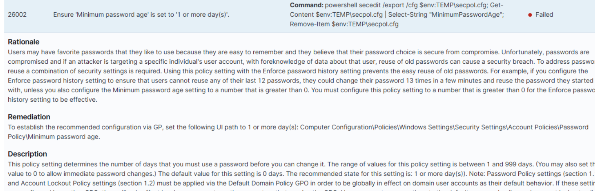
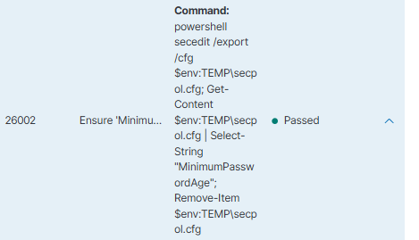
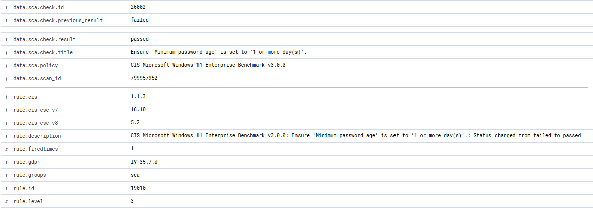

# LAB-004 — Security Configuration Assessment & Remediation

**Status:** ✅ Complete

## Objective

Use Wazuh Security Configuration Assessment to find a failed CIS Windows 11 hardening check, understand why it matters, remediate it, rescan, and prove **independently** that the check moved from failed to passed.

The one lab that is not about detection. It is about configuration assessment, hardening and validated remediation — a different and very employable skill.

## Environment

| Component | Value |
|---|---|
| Endpoint | `WIN11-01` — Windows 11 Pro, standalone (not domain-joined) |
| SCA policy | **CIS Microsoft Windows 11 Enterprise Benchmark v3.0.0** — `cis_win11_enterprise.yml`, bundled with the agent at `ruleset\sca\` |
| Agent | Wazuh Agent 4.14.7, SCA enabled with `scan_on_start` |

## The finding

| Field | Value |
|---|---|
| Wazuh SCA check ID | `26002` |
| CIS control | `1.1.3` · CIS Controls v8 `5.2` · v7 `16.10` |
| Title | Ensure 'Minimum password age' is set to '1 or more day(s)'. |
| Initial result | **Failed** |
| Effective value | `MinimumPasswordAge = 0` |

### Why it matters

A minimum password age of zero lets an account change its password again immediately. Combined with password-history enforcement, a user can cycle through the entire history in a few minutes and return to a password they already used — quietly defeating the history control. A minimum age of one day makes that impractical.

On this standalone host the setting governs **local accounts**. In a domain environment the equivalent would normally be controlled through the Default Domain Policy.

Reading the rationale before applying the fix is what makes this a security action rather than a checkbox exercise.

## Test procedure

### 1. Record the before state

```powershell
net accounts

secedit /export /cfg "$env:TEMP\secpol.cfg"
Get-Content "$env:TEMP\secpol.cfg" | Select-String "MinimumPasswordAge"
Remove-Item "$env:TEMP\secpol.cfg"
```

```text
MinimumPasswordAge = 0
```

`secedit /export` is used deliberately: it is the same mechanism the SCA check itself runs, so it verifies the same thing Wazuh verifies rather than something adjacent.

### 2. Remediate

```powershell
net accounts /minpwage:1
```

### 3. Verify at the OS level

```powershell
secedit /export /cfg "$env:TEMP\secpol.cfg"
Get-Content "$env:TEMP\secpol.cfg" | Select-String "MinimumPasswordAge"
```

```text
MinimumPasswordAge = 1
```

### 4. Trigger a fresh assessment

```powershell
net stop wazuh
net start wazuh
```

`scan_on_start` makes the SCA module run a new assessment when the agent starts.

## Expected vs actual result

| Stage | Expected | Actual |
|---|---|---|
| Before | `MinimumPasswordAge = 0`, SCA **Failed** | ✅ |
| After remediation | `MinimumPasswordAge = 1` at OS level | ✅ |
| After rescan | Wazuh reports the check as passed | ✅ Rule `19010` |

The decisive evidence is the SCA event itself:

```json
"check": {
  "result": "passed",
  "previous_result": "failed",
  "id": "26002",
  "title": "Ensure 'Minimum password age' is set to '1 or more day(s)'."
}
```

| Field | Value |
|---|---|
| Wazuh rule | `19010`, level 3 |
| Description | CIS Microsoft Windows 11 Enterprise Benchmark v3.0.0: Ensure 'Minimum password age' is set to '1 or more day(s)'.: Status changed from failed to passed |
| Scan ID | `799957952` |

Level 3 is deliberate on Wazuh's part: a check moving to *passed* is good news, recorded for the audit trail rather than raised as an incident.

This is the whole point of the lab. "I changed the setting" is self-reporting. `previous_result: failed → result: passed`, observed by the tool on its own next scan, is independent verification.

## Evidence



*The finding in Configuration Assessment: check `26002` **Failed**, the exact `secedit` command the check runs, and the CIS rationale and remediation path — the reasoning summarised under "Why it matters" above.*



*The same check after remediation and rescan: **Passed**.*



*The decisive evidence — key fields of the `19010` alert: `previous_result: failed`, `result: passed`, the policy name, scan ID, CIS `1.1.3`, and the rule description. Wazuh recorded the state change on its own rescan.*

## Troubleshooting — the dashboard looked stale

After remediation and an agent restart, the **Configuration Assessment page still showed the previous scan timestamp** and the check still rendered as `Failed`. It looked like the remediation had not taken effect.

It had. The agent log proved a fresh scan had started and completed:

```text
sca: INFO: Module started.
sca: INFO: Loaded policy '...\ruleset\sca\cis_win11_enterprise.yml'
sca: INFO: Starting Security Configuration Assessment scan.
```

Searching the alert index directly surfaced the real `19010` event with the state change, timestamped to match the scan in the agent log exactly.

**Lesson:** a SIEM's summary view and its underlying event stream are not the same thing. When an aggregated panel contradicts the endpoint's own logs, go to the raw events.

## Lessons learned

- SCA answers a different question from detection rules: not *"is something happening?"* but *"is this machine configured safely?"*
- The strongest remediation evidence is a third party independently re-observing the change.
- Verify with the same mechanism the checker uses, not with a friendlier command that reports something similar.
- Trust endpoint logs over dashboard summaries when the two disagree.
- Pick a first remediation that is understandable, reversible and low-risk. Anything touching networking, credential providers, BitLocker or remote access can lock you out of your own lab.

## Portfolio takeaway

A complete, auditable hardening cycle: finding → rationale → before state → remediation → OS-level verification → rescan → independent confirmation. This is the exact shape of evidence a compliance or vulnerability-management team works with every day.
